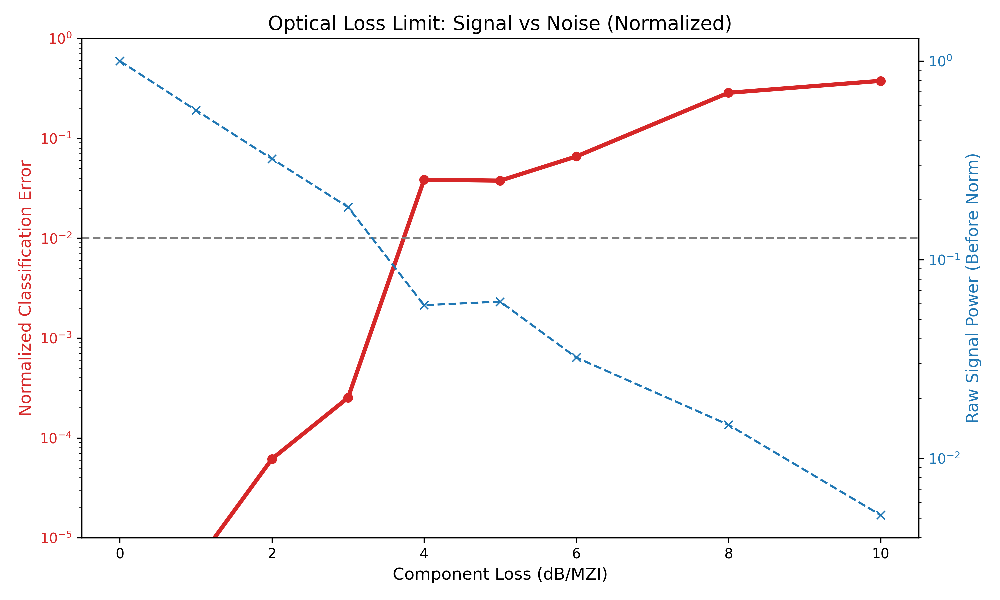

# Optical Loss Budget Analysis
**Study on Signal-to-Noise Ratio (SNR) limits in Optical Neural Networks.**

## 📖 Overview
This project investigates the **robustness against optical propagation loss** in photonic integrated circuits.
By simulating signal attenuation and detector noise, we determine the maximum allowable component loss (dB/MZI).

## 🔬 Experiment Setup
- **Task**: 2x2 Image Classification (Normalized Output).
- **Noise Floor**: 0.1% (Detector Dark Current / Thermal Noise).
- **Method**: 
    1. Attenuate signal by $X$ dB per component.
    2. Add Gaussian noise to the output.
    3. Normalize the output vector ($P_{norm} = P / \Sigma P$) and calculate classification accuracy.

## 📊 Key Results

### The "3.0 dB" Safety Margin
Using output normalization, the AI maintains **< 0.1% Error** even when the signal attenuates to **18% of its original power** (3.0 dB loss per MZI).

- **0.0 - 3.0 dB**: **Loss $\approx$ 0.0003 (Success)**.
- **4.0 dB**: Loss jumps to 0.0384 (SNR Limit reached).
- **> 5.0 dB**: Classification fails.

Since typical fabrication loss is < 1.0 dB/MZI, this architecture has a **sufficient safety margin** for real-world implementation.

## 🛠 Technology Stack
- **Simulator**: DiffPhoton (JAX)
- **Analysis**: Signal-to-Noise Ratio (SNR) Evaluation

## 👨‍💻 Author
**Optical Loss Analysis Project**
